  

  <a href="https://freddynanez.lat"><b>Portfolio</b></a> ·
  <a href="https://www.loopmind.lat/"><b>Loopmind</b></a> ·
  <a href="https://ai-chat-freddy.vercel.app/"><b>Ask my AI about me</b></a> ·
  <a href="https://www.linkedin.com/in/freddy-%C3%B1a%C3%B1ez-4b0a1b267/"><b>LinkedIn</b></a>

 

## Hey, I'm Freddy

I'm 20. Born in Ica, raised in Pilpichaca, Huancavelica, one of the poorest regions of Peru. I taught myself to code with Harvard's CS50 while people asked why a business student would bother. Today I build AI products end to end. The strategy, the product, and the software.

Right now I run **Loopmind**, an AI-first growth agency. It's the first thing I gave everything to instead of splitting myself five ways.

I want to talk to people who are building something. Especially if they're starting from where I started.

 

## What I'm building

| | | |
|---|---|---|
| **Loopmind** | AI-first growth agency. Sites, products, and AI automation for businesses across Latin America and beyond. | [loopmind.lat](https://www.loopmind.lat/) |
| **Novo** | An AI career agent that finds scholarships, fellowships, exchanges, and hackathons, and helps you apply. Built for students like the one I was. | [Live](https://novo-international.vercel.app/) |
| **Zegen** | A finance copilot for young people in Peru who want to understand their money without it feeling like homework. | [Live](https://zegen.loopmind.lat/) |
| **Sift** | An autonomous sourcing agent. A 7-stage AI pipeline that processed 304 real purchase requests across 6 languages, 19 countries, and 3 currencies. Built in 36 hours. | START Hack 2026, St. Gallen |
| **LuzIA** | An emotional-support AI companion built on psychological frameworks, with red-flag detection that escalates by a safety manual. | 2nd place of 800+, National AI Hackathon |
| **AI Chat Freddy** | A chatbot trained on my story. Ask it anything you want to know about me. | [Live](https://ai-chat-freddy.vercel.app/) |

 

## The stack I run

            

**Where I learned it:** Harvard CS50 · Harvard CS50P · YouTube · Coursera · Claude Code · shipping things that break.

None of it came from a finished course. It came from needing something to work.

 

## The road

| | |
|---|---|
| **2019** | Admitted at 14 to COAR Huancavelica, where Peru takes its best students. Full scholarship, boarding, IB Diploma Programme. Top 10% of my class. |
| **2022** | PUCP, the best university in the country. Business Management. |
| **2024** | Faculty of Management, top 5%. I found innovation, technology, and entrepreneurship. |
| **2024 – 2025** | Board member at START Lima. I led the Road to START Fellowship: 300+ applicants, two Peruvians admitted to the Switzerland program. |
| **Jun 2025** | Open innovation intern at Banco de Crédito del Perú, the largest bank in the country. It came after six months of noes. |
| **Nov 2025** | First hackathon, no technical background. 2nd place of 800+ applicants at the National AI Hackathon. |
| **2025 – 2026** | University Innovation Fellow. Stanford's Hasso Plattner Institute of Design and the DesignLab at the University of Twente. |
| **Mar 2026** | START Hack, St. Gallen, Switzerland. We funded the trip with a virtual pollada that reached a million views and national press. |
| **Jul 2026** | SUSI Scholar in Entrepreneurship and Economic Prosperity, U.S. Department of State. Columbus, Chicago, Washington D.C. |
| **2026** | Loopmind. |

Every jump had a no before the yes. The rejections, the burnout, and the parts that did not work out are on my [portfolio](https://freddynanez.lat), because telling only the half that worked wouldn't be telling the story.

 

## Talk to me

    

 

  <i>I'm not where I want to be, but I'm not where I started. And I'm grateful for that.</i>

